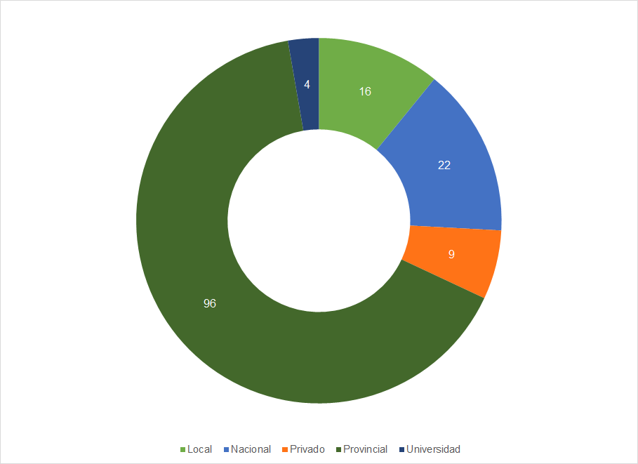
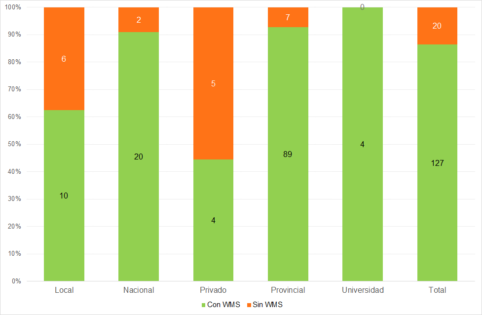

La evaluación de IDE de IDERA
=============================

Antecedentes
------------

### IDERA

Según consta en su sitio web, la Infraestructura de Datos Espaciales de la
República Argentina (IDERA) es “una comunidad de información geoespacial que
tiene como objetivo propiciar la publicación de datos, productos y servicios, de
manera eficiente y oportuna como un aporte fundamental a la democratización del
acceso de la información producida por el Estado y diversos actores, y al apoyo
en la toma de decisiones en las diferentes actividades de los ámbitos público,
privado, académico, no gubernamental y sociedad civil[^1].

[^1]: [IDERA - ¿Qué es IDERA?](https://www.idera.gob.ar/index.php?option=com_content&view=article&id=274&Itemid=203)

En tal sentido, cabe considerar a la Información Geográfica como un bien público
y, por tanto, a su acceso y uso como un servicio público.

En términos organizacionales, según el reglamento de funcionamiento publicado en
IDERA (2015), la Coordinación Ejecutiva de IDERA está a cargo del Instituto
Geográfico Nacional, cuyas funciones son facilitar el trabajo que se realiza
desde los Grupos de Trabajo y el Equipo Coordinador para implementar sus
decisiones; recibir y resguardar la documentación; celebrar convenios; y
convocar a reuniones.

Para articular el trabajo, el Equipo Coordinador de IDERA agrupa a
representantes de todas las jurisdicciones y niveles de gobierno del país, así
como de los consejos federales de Catastro y Planificación y de las
universidades públicas, teniendo por responsabilidades generales la conducción
del funcionamiento de IDERA y la articulación con los Grupos de Trabajo[^2].

[^2]: En términos más específicos, el reglamento de funcionamiento de IDERA
establece que su Equipo Coordinador tiene por funciones la promoción de
legislación, de los distintos niveles de gobierno, referida a las IDE; el
fortalecimiento institucional de las organizaciones que integran IDERA; la
emisión de las opiniones consultivas que se le soliciten; la coordinación y
promoción de la difusión de datos geoespaciales mediante el auspicio de
jornadas; la cooperación con foros, agencias y organismos regionales e
internacionales dedicados a la temática IDE; la modificación de su propio
reglamento; la elaboración de su Plan Anual de Trabajo; la convocatoria a la
opinión de expertos; la elaboración, comunicación y publicación de la Memoria
Anual de IDERA; la definición del número, temas y objetivos de los Grupos de
Trabajo; la coordinación de las actividades de los Grupos de Trabajo; la
aprobación de los productos de los Grupos de Trabajo; la consideración de las
solicitudes de incorporación a IDERA de nuevos actores.

Una parte de las actividades de IDERA es realizada por Grupos de Trabajo de
libre participación. Cada grupo tiene una serie de metas y objetivos
planificados anualmente y genera documentos, recomendaciones, estándares y
productos necesarios para que IDERA funcione y sirva a las IDE del país. Los
grupos Marco Institucional; Academia y Ciencia; Capacitación; Difusión y
Comunicación se orientan más a cuestiones institucionales. Los grupos Metadatos;
Tecnología y Desarrollo; e Información Geoespacial realizan las adaptaciones
locales de los estándares internacionales, las cuales son volcadas en documentos
y recomendaciones que son las que se consideran en la Evaluación de IDE. El
Grupo Marco Institucional fue el encargado de diseñar el procedimiento de la
Evaluación en conjunto con personal de la Coordinación Ejecutiva de IDERA.
Dentro de cada uno de los grupos se elige un representante que lo coordine y lo
represente ante el Equipo Coordinador.

### Estudio previo de los nodos IDE

Como primer antecedente en materia de evaluación, la Coordinación Ejecutiva de
IDERA realizó un trabajo de seguimiento y monitoreo de los nodos IDE existentes
en el país desde 2014 a 2017. Entendiendo a los nodos como cada uno de los
organismos que publica información geográfica, independientemente de si existe
una IDE superior que los aúne.

El trabajo surgió por la necesidad de conocer qué organismos de Argentina, sin
importar su jurisdicción o nivel en el organigrama, publicaban información
geográfica y en qué estado de desarrollo de la IDE se encontraban. Inicialmente
se trató de mantener la información publicada por IDERA actualizada en su página
web y de conocer las necesidades de las IDE del país.

El seguimiento se realizó relevando los datos comunes a todas las IDE, links de
acceso, tipo y jurisdicción, software utilizado, estado de apertura y
observaciones sobre su funcionamiento. A partir de estos datos es que se
analizaron los resultados, para encontrar las problemáticas más comunes en la
implementación de las IDE y para generar las variables de la evaluación.

De un total de 147 nodos IDE que formaban parte de IDERA en 2017 (que se
detallan en el anexo del presente trabajo) según se advierte en el siguiente
gráfico, casi dos tercios correspondían a organizaciones gubernamentales de
nivel provincial, un séptimo era del gobierno nacional y un décimo municipales,
con una participación mínima en el total del sector privado y de las
universidades.

##### Gráfico 1 - Cantidad de Nodos IDE por jurisdicción

##### *Fuente: elaboración propia en base al relevamiento realizado por el Instituto Geográfico Nacional*

En 2017 (Gráfico 2) la mayoría de las provincias relevadas se encontraban
representadas por 1 o 2 nodos IDE, pero las provincias de Misiones, Neuquén y
Tucumán mostraban una infraestructura muy descentralizada, siendo esta última la
que más nodos tenía (21). También las provincias de Buenos Aires, Mendoza y
Formosa habían desarrollado más de tres nodos, a fin de no centralizar la
información.

##### Gráfico 2 - Cantidad de Nodos por provincia

##### *Fuente: elaboración propia en base al relevamiento realizado por el Instituto Geográfico Nacional*

Tal como se observa en el Gráfico 3, poco más de un tercio de los organismos
relevados poseían un catálogo de metadatos que permitiese el descubrimiento de
la información publicada. Así, el 63% de los nodos IDE registrados no lo habían
implementado, a pesar de ser una herramienta esencial dentro de una IDE.

##### Gráfico 3 - Cantidad de nodos por disponibilidad de Catálogo de Metadatos

##### *Fuente: elaboración propia en base al relevamiento realizado por el Instituto Geográfico Nacional*

Del análisis de la disponibilidad de geoservicios de visualización de capas
(WMS) que vemos en el Gráfico 4, se advierte que todavía existían muchas IDE que
no publicaban WMS, aunque la gran mayoría ya había implementado esta cuestión
básica para una IDE.

El mayor inconveniente residía en la falta de geoservicios de descarga (WFS),
tal como muestra el Gráfico 5, ya que en casi la mitad de las IDE relevadas no
se encontraba disponible este servicio.

##### Gráfico 4 - Cantidad de nodos por disponibilidad de Servicio de visualización de WMS

##### *Fuente: elaboración propia en base al relevamiento realizado por el Instituto Geográfico Nacional*

##### Gráfico 5 - Cantidad de nodos por disponibilidad de Servicio de descarga de capas WFS

##### *Fuente: elaboración propia en base al relevamiento realizado por el Instituto Geográfico Nacional*

Un tema de gran importancia en la comunidad de IDERA es lograr que las
implementaciones IDE sean lo más sustentables posibles, para ello se recomienda
el uso de software libre y de código abierto. Así, se observa en el Gráfico 6
que la gran mayoría de los organismos eligían dos de las más populares
herramientas de servidores de mapas de este tipo como son Geoserver[^3] y
MapServer[^4], aunque algunos organismos aún usaban programas pagos, como ArcGIS
Server[^5].

[^3]: [GeoServer](http://geoserver.org/)

[^4]: [MapServer](https://mapserver.org/)

[^5]: [ArcGIS Server](https://enterprise.arcgis.com/es/server/latest/get-started/windows/what-is-arcgis-for-server-.htm)

##### Gráfico 6 - Cantidad de nodos por tipo de Software de visualización de WMS

##### *Fuente: elaboración propia en base al relevamiento realizado por el Instituto Geográfico Nacional*

En el análisis de la estandarización de la publicación de la información,
resulta relevante que las herramientas implementadas para dicha tarea se
personalicen para que posean los datos correspondientes al organismo que realiza
la publicación de la información. Una de las fallas recurrentes son los datos
incompletos asociados al Servicio WMS, ya que, por no personalizarse con la
información del organismo, muchos geoservicios quedan nombrados de manera
predeterminada como “Geoserver Web Map Service”, como se ve en el Gráfico 7, lo
que los hace difícil de identificar y distinguir.

##### Gráfico 7 - Cantidad de nodos por personalización de los Metadatos de Servicio WMS

##### *Fuente: elaboración propia en base al relevamiento realizado por el Instituto Geográfico Nacional*

Como parte de las tareas dirigidas a facilitar el descubrimiento y el acceso a
la información publicada por sus integrantes, IDERA realizó en 2016 la
instalación de un catálogo de metadatos propio con el software Geonetwork. Desde
el mismo es posible “cosechar” la información publicada a través de los
geoservicios, a fin de que sea más fácil encontrarla para los usuarios, entre
otros beneficios. En esta tarea es que se cosecharon los geoservicios de
visualización WMS y de metadatos CSW de los organismos que los tienen
disponibles. De esta manera, además de poder crear registros de metadatos para
todas las capas existentes, aún si el nodo IDE no tiene su propio servicio de
catálogo, se encontró que muchos servicios, en particular los WMS, tenían
problemas de funcionamiento, lo que imposibilitaba su uso frecuentemente, como
vemos en el Gráfico 8.

##### Gráfico 8 - Errores en la cosecha de geoservicios por tipo de fuente de datos

##### *Fuente: elaboración propia en base al relevamiento realizado por el Instituto Geográfico Nacional*

### Del seguimiento de nodos a la necesidad de su evaluación

A partir de la experiencia de seguimiento de nodos referida, surge que los
niveles de aplicación de los estándares de IDERA, son muy heterogéneos. Ello ha
permitido identificar la existencia de muchas oportunidades de mejora en los
nodos IDE evaluados.

Además de estos resultados del seguimiento y monitoreo de los nodos de IDERA, se
destaca como otro hito muy importante en el proceso previo al desarrollo de la
evaluación de IDE de IDERA, el pedido por parte del Equipo Coordinador al Grupo
de Trabajo Marco Institucional de generar algún sello o certificación de que las
IDE cumplen con los estándares de IDERA.

Así, se llegó a la conclusión de que se tornaba imprescindible definir una
metodología de evaluación de la aplicación de las recomendaciones generadas por
IDERA, que apunte a lograr su plena y correcta implementación por parte de todos
sus integrantes, como una forma de garantizar el nivel de interoperabilidad que
requiere toda IDE.

A partir de estos antecedentes, el proceso del que surge la evaluación de IDE de
IDERA ha incluido, por parte del Grupo de Trabajo Marco Institucional, una
importante labor de desarrollo preliminar de ejemplos de posibles criterios y
formas de calificar, originalmente, a las IDE que formen parte de IDERA.

Contando con este importante trabajo previo, la Coordinación Ejecutiva de IDERA
procuró analizar los componentes de las IDE y los estándares y recomendaciones
publicados por IDERA, para entender cuáles eran las variables con mayor
capacidad para dar cuenta del estado de situación de las IDE en materia de
cumplimiento de dichos estándares y recomendaciones y que, a su vez, resultasen
factibles de traducirse en indicadores de cara a su evaluación.

A su vez, IDERA busca que la evaluación genere una oportunidad para desarrollar
actividades de capacitación dirigidas a quienes integran las diversas IDE, en
relación a la adecuada implementación de las recomendaciones, en el marco de un
acompañamiento institucional.

IDERA espera, de este modo, contar con más y mejores herramientas para acompañar
a las IDE, tanto consolidadas como incipientes, en la implementación de los
estándares establecidos, de forma continua y a largo plazo, a través de una
metodología que pueda utilizar tanto IDERA como sus integrantes para
autoevaluarse.

Desde IDERA eso permite destacar a quienes generen implementaciones
estandarizadas e interoperables acordes con sus recomendaciones y, en el otro
extremo de la escala de valoración, identificar las experiencias que requieren
un mayor esfuerzo en pos de transformar sus debilidades en fortalezas.
