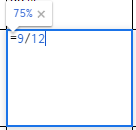
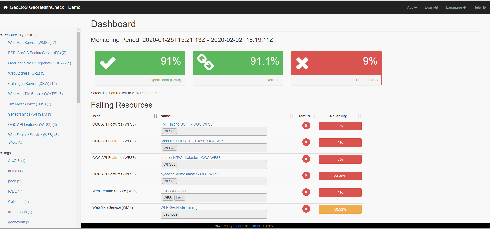

La evaluación de IDE de IDERA
=============================

Sugerencias para la implementación
----------------------------------

En base a las propuestas de mejoras desarrolladas en la sección anterior, se
presentan, entonces, las siguientes sugerencias para su implementación efectiva
en la evaluación de IDE de IDERA.

Así, en primer lugar, se desarrolla una estructura para el esquema de evaluación
con el objetivo de facilitar la asignación de los valores correspondientes a la
IDE, en los distintos indicadores que se evalúan.

En segundo término, se presenta un ejemplo de la propuesta de dotar al informe
anual de un formato de formulario, de modo tal que resulte más sencillo de
responder para los responsables de las IDE, a la vez que permita un mejor
procesamiento estadístico de las respuestas obtenidas.

Como tercera cuestión, se muestra un modelo de base de datos que podría resultar
de utilidad para dar seguimiento a la totalidad de los nodos IDE que integran
IDERA, y no solamente a las IDE de máxima jerarquía que resultan pasibles de
evaluación.

Finalmente, se da cuenta de la potencia de una herramienta, basada en software
libre y de código abierto, para el monitoreo de la salud de los geoservicios de
las IDE de IDERA, entre otros posibles usos.

### Estructura facilitadora del esquema de evaluación

Se sugiere modificar la estructura del esquema de evaluación (archivo de hojas
de cálculo), incorporando una serie de elementos tendientes a lograr que la
tarea de dar cuenta de su situación respecto a los distintos indicadores
contemplados en la evaluación, resulte más sencilla para los responsables de las
IDE de máxima jerarquía, como así también para la persona de la Coordinación
Ejecutiva encargada de realizar la evaluación.

Así, se propone generar una tabla dividida en distintas hojas (Figura 2), una
para cada uno de los cuatro temas que forman parte de la evaluación de IDE de
IDERA y, además:

-   Cuadro de indicadores para Productor de DByF.

-   Cuadro de indicadores para Productor de datos Temáticos.

-   Cuadro de elementos a evaluar de Geoportal y Visualizador

-   Tabla de DByF para evaluar por cada capa

-   Resumen de calificación por tema y calificación final

##### Figura 2 - Miniatura del Esquema de Evaluación

##### *Fuente: elaboración propia en base al relevamiento realizado por el Instituto Geográfico Nacional*

Asimismo, también resulta de utilidad incorporar un cuadro de indicadores
separados por tema (Figura 3), que incluya las fórmulas correspondientes, como
otro elemento que contribuya a facilitar y mejorar el análisis.

##### Figura 3 - Detalle de fórmula por temas

##### *Fuente: elaboración propia en base al relevamiento realizado por el Instituto Geográfico Nacional*

De esta forma, es posible visualizar mejor la sumatoria de los resultados de
cada tema, según surge de los respectivos cuadros.

##### Figura 4 - Detalle de listado de opciones variables binarias

##### *Fuente: elaboración propia en base al relevamiento realizado por el Instituto Geográfico Nacional*

Así, se propone un conjunto de fórmulas que permiten asignar el puntaje
correspondiente en los indicadores cuyas respuestas posibles son “Sí” o “NO”
(Figura 4 y 5).

##### Figura 5 - Ejemplo de fórmula para variables binarias

##### *Fuente: elaboración propia en base al relevamiento realizado por el Instituto Geográfico Nacional*

Del mismo modo, para las variables cuyos resultados se calculan en razón del
porcentaje de capas que cumplen con la respectiva recomendación, es útil usar
fórmulas del tipo que se muestra en la siguiente figura (Figura 6).

##### Figura 6 - Ejemplo de fórmula para el cálculo del porcentaje de capas

##### *Fuente: elaboración propia en base al relevamiento realizado por el Instituto Geográfico Nacional*

La solapa de DByF (Figura 7) permite seleccionar las capas que publica, como
DByF, cada organismo y determinar si cumple o no con las condiciones requeridas,
incluyendo una fórmula que posibilita calcular el porcentaje de cumplimiento por
indicador.

##### Figura 7 - Solapa de DByF de la Evaluación IDE v2

##### *Fuente: elaboración propia en base al relevamiento realizado por el Instituto Geográfico Nacional*

### El informe anual como un formulario

Vale recordar que el informe anual consiste en una serie de ítems de información
que se le solicita a la IDE sobre sus características y su situación. Algunos de
estos requerimientos son sencillos de responder, en formato de texto plano o
hipervínculo. Pero en otros casos, se necesita más información, lo que implica
subir una imagen u otro tipo de archivo.

La posibilidad de utilizar para este proceso un formulario de Google (Figura 8)
presenta como ventajas que permite introducir restricciones a la forma de
responderlo, incluyendo listas de opciones de respuesta que hacen más fácil
completarlo. También, esta herramienta hace que la información se vuelque de
manera automática en una tabla, que luego permite su rápido procesamiento y
generar diversos reportes estadísticos.

En contraposición, los formularios de Google presentan algunas desventajas. Por
ejemplo, el hecho de que la opción de subir un archivo, obliga, a quien lo haga,
a loguearse con su usuario de Google. Además, el formato de estos formularios es
poco intuitivo y no permite realizar múltiples ediciones.

De este modo, aunque se reconoce que no hay una solución del todo óptima para el
envío del informe anual por parte de las IDE, se propone seguir explorando las
posibilidades que ofrece el uso de formularios de Google[^11] para esta tarea.

[^11]: [Formularios de
Google](https://www.google.com/intl/es-419_ar/forms/about/)

##### Figura 8 - Ejemplo de formulario de Google para informe anual

##### *Fuente: elaboración propia en base a IDERA y Google.* 

### La Base de Datos de IDERA

Siguiendo el ejemplo de la experiencia de eSDI-NET+ (Figura 9) detallada en el
estado del arte del presente trabajo y teniendo en cuenta la cantidad de nodos
IDE existentes en la Argentina, resultaría muy valioso realizar un seguimiento,
a lo largo del tiempo, no sólo de las IDE de máxima jerarquía, sino de todas,
teniendo en cuenta que cada IDE tiene que ser responsable de informar sobre los
nodos que la componen.

##### Figura 9 - Base de datos de eSDI-Net+

##### *Fuente: [eSDI-Net+ Database of SDI](https://esdinetplus.eu/best_practice/database.html)*

Por otro lado, el uso de una base de datos permitirá mejorar la manera en que se
actualiza la información, pudiendo inclusive generar algún tipo de formulario
web para que las IDE envíen las actualizaciones de datos. Además, ello
posibilitará que el sitio web de IDERA, que publica los enlaces de acceso a las
IDE, se mantenga actualizado de una manera más sencilla y económica.

Respecto a ello, se presenta, a continuación, un ejemplo de modelo de
entidad-relación de base de datos que permite cubrir la totalidad de los datos a
relevar de las IDE (Figura 10).

##### Figura 10 - Ejemplo de modelo de entidad-relación de base de datos para IDERA

##### *Fuente: elaboración propia*

### Herramienta de monitoreo de geoservicios: GeoHealthCheck

Una herramienta de software libre y de código abierto que se desarrolló en el
último tiempo y que tiene gran potencial respecto a la posibilidad de
automatizar el proceso de relevamiento de la salud de los geoservicios de las
diversas IDE a evaluar, es la de GeoHealthCheck (Figura 11).

Está definida como “QoS (Quality of Service) Monitor for Geospatial Web
Services”, es decir, como un monitor de la calidad de los servicios web
geoespaciales.

Desde sus aspectos técnicos se trata de una aplicación en lenguaje Python que
permite dar soporte al monitoreo de la disponibilidad y de la cantidad de tiempo
de operación de los servicios web de OGC.

A su vez, esta herramienta, a través de complementos, puede expandir sus
capacidades para utilizarse en la realización de verificaciones específicas de
recursos.

##### Figura 11 - Interfaz de la demo de GeoHealthCheck

##### *Fuente: [GeoHealthCheck](https://geohealthcheck.org/)*

GeoHealthCheck posee un sencillo sistema de inicio de sesión para que los
usuarios puedan crear sus propios chequeos (probes) en formato de plugins
(aplicación que en un programa informático añade una funcionalidad
adicional)[^12]. Ello solo requiere conocimientos básicos de Python y de
servicios OGC, ya que todo el procedimiento se encuentra detallado en la
documentación del software (Figura 12).

[^12]: [6. Plugins — GeoHealthCheck 0.8.dev0
documentation](https://docs.geohealthcheck.org/en/latest/plugins.html)

##### Figura 12 - Ejemplo de chequeo con GeoHealthCheck

##### *Fuente: [GeoHealthCheck](https://geohealthcheck.org/)*
